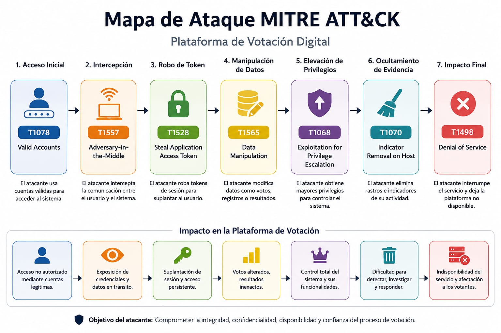

# Análisis de Riesgos — Plataforma de Votación Electrónica

**Tarea 2 · Ingeniería en Sistemas de Información (ISI) · UTU**

Análisis de riesgos de seguridad sobre una plataforma de votación electrónica basada en cifrado homomórfico y arquitectura de microservicios sobre Blockchain. El
trabajo aplica metodologías estándar de la industria para identificar, priorizar y mitigar amenazas sobre un sistema de infraestructura pública crítica.

---

## Sistema analizado

Plataforma de sufragio remoto que garantiza la integridad del voto sin revelar la identidad del votante. Compuesta por cinco componentes principales:

| Componente                    | Rol                                                |
| ----------------------------- | -------------------------------------------------- |
| Frontend (Web/App)            | Interfaz de emisión del voto                       |
| API Gateway / WAF             | Punto de entrada y filtrado de tráfico             |
| Servicio de Autenticación     | Validación de identidad contra el padrón electoral |
| Servicio de Emisión y Cifrado | Procesamiento con cifrado homomórfico              |
| Repositorio Blockchain        | Almacenamiento inmutable de votos cifrados         |

---

## Metodologías aplicadas

- **STRIDE** — Identificación de amenazas por categoría (Spoofing, Tampering, Repudiation, Information Disclosure, DoS, Elevation of Privilege)
- **DREAD** — Puntuación cuantitativa de severidad (Daño, Reproducibilidad, Explotabilidad, Usuarios afectados, Descubribilidad)
- **MITRE ATT&CK** — Mapeo de técnicas a tácticas del framework (Navigator layer incluido)
- **RFC 6973** — Evaluación de anonimato y privacidad del votante
- **AGESIC NTCSI** — Marco normativo de referencia (regulación uruguaya)

  ***

## Estructura del repositorio

```
├── docs/
│ ├── 01-inventario-activos.md
│ ├── 02-arquitectura-trust-boundaries.md
│ ├── 03-analisis-stride.md
│ ├── 04-priorizacion-dread.md
│ ├── 05-mapa-attack.md
│ ├── 06-plan-mitigacion.md
│ └── 07-riesgos-residuales.md
├── diagrams/
│ ├── Arquitectura.drawio
│ ├── Arquitectura.drawio.png
│ ├── Escenario_8.json / .svg
│ ├── attack-flow.png
│ └── matriz-mitre.png
├── prompts/
│ └── 00-memory-bank.md
├── tools/
│ └── escenario_8.json
└── docs/referencia-tls.md
```

---

## Hallazgos principales

| ID   | Amenaza                               | STRIDE           | Prioridad |
| ---- | ------------------------------------- | ---------------- | --------- |
| TH01 | DDoS sobre API Gateway                | DoS              | Alta      |
| TH02 | Manipulación del voto en tránsito     | Tampering        | Alta      |
| TH03 | Suplantación de identidad del votante | Spoofing         | Media     |
| TH04 | Correlación identidad–voto en memoria | Info. Disclosure | Alta      |

Los controles propuestos incluyen: Anti-DDoS perimetral con Rate Limiting, segregación de red (VLAN) con validación criptográfica en tránsito, tokenización de PII en
logs, y autenticación multifactor con Cédula de Identidad Digital.

---

## Flujo de Ataque (MITRE ATT&CK)



> Escenario 8 — mapeado con MITRE ATT&CK Navigator.

---

## Riesgos residuales aceptados

| Riesgo                             | Justificación                                                   |
| ---------------------------------- | --------------------------------------------------------------- |
| Coerción física del votante        | Fuera del perímetro técnico; requiere mitigación legal/policial |
| Zero-Day en HSM certificado        | Probabilidad extremadamente baja en hardware FIPS 140-2         |
| Malware en dispositivo del usuario | La disociación de red impide afectar el escrutinio general      |

---
