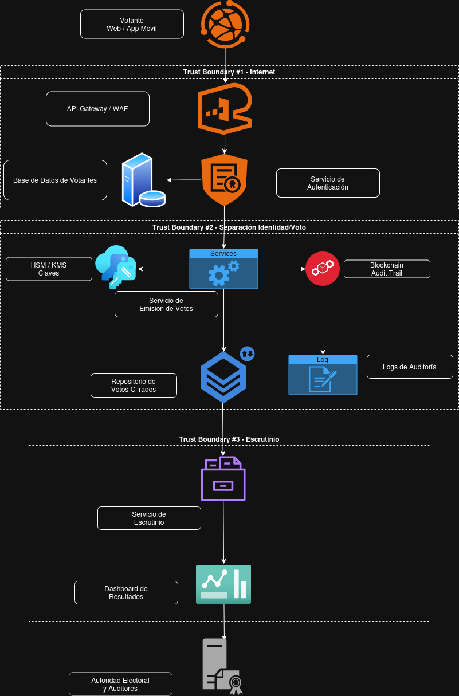

3. ARQUITECTURA DEL SISTEMA

3.1 Diagrama de Arquitectura

3.2 Que es un Trust Boundary

Un trust boundary, o limite de confianza, es un punto del sistema donde cambia el nivel de confianza entre usuarios, redes o componentes. En esos puntos pueden aparecer riesgos de acceso no autorizado, alteracion de datos o fuga de informacion.

3.3 Zonas Generales del Sistema

Para entender mejor la arquitectura, el sistema puede dividirse en tres zonas:

- Zona externa: votante e Internet.
- Zona perimetral: aplicacion web, aplicacion movil y API Gateway.
- Zona interna: autenticacion, emision de voto, escrutinio, HSM, repositorios y auditoria.

3.4 Flujo de Datos

El flujo de datos se diseno para reducir la relacion directa entre la identidad del votante y el contenido de su voto.

1. El votante accede a la aplicacion web o movil desde Internet.
2. La aplicacion envia la solicitud al API Gateway.
3. El sistema valida la identidad del votante mediante el servicio de autenticacion.
4. Si la autenticacion es valida, se habilita la emision del voto por medio de un token temporal.
5. El voto se envia al servicio de emision, donde es procesado y cifrado.
6. El voto cifrado se guarda en el repositorio correspondiente y se registra evidencia en blockchain.
7. Al cierre de la eleccion, el servicio de escrutinio procesa los votos cifrados y genera los resultados.

3.5 Actores del Sistema

| Actor | Descripcion | Privilegios |
| --- | --- | --- |
| Votante | Ciudadano que emite el sufragio. | Puede autenticarse y emitir su voto. |
| Autoridad Electoral | Responsable de supervisar el proceso. | Puede revisar reportes, auditoria y resultados segun su rol. |
| Auditores | Revisan el funcionamiento y la trazabilidad del sistema. | Tienen acceso de lectura a registros y evidencia de auditoria. |
| Atacante | Actor malicioso interno o externo. | Intenta vulnerar accesos, alterar datos o afectar la disponibilidad. |

3.6 Limites de Confianza (Trust Boundaries)

TB1 - Internet / Aplicacion Web-Movil y API Gateway

Este limite separa la red publica de los componentes expuestos del sistema. Su objetivo es filtrar trafico no autorizado y reducir ataques provenientes de Internet.

TB2 - API Gateway / Servicio de Autenticacion

Este limite separa la entrada publica del sistema del componente que valida la identidad del votante. Aqui se controla que solo lleguen solicitudes validas al proceso de autenticacion.

TB3 - Servicio de Autenticacion / Servicio de Emision de Voto

Este limite separa el proceso de identificacion del proceso de votacion. Es uno de los limites mas importantes, porque ayuda a evitar una relacion directa entre quien vota y que voto emite.

TB4 - Servicio de Emision / Repositorio de Votos Cifrados y Blockchain

Este limite separa la generacion del voto cifrado de su almacenamiento y registro. Aqui es importante asegurar que el voto no sea modificado antes de quedar registrado.

TB5 - Servicios Internos / HSM

Este limite separa a los servicios que usan funciones criptograficas del modulo que protege las claves. Su objetivo es evitar la exposicion directa del material criptografico.

TB6 - Servicio de Escrutinio / Repositorio de Votos

Este limite separa el proceso de conteo del lugar donde se almacenan los votos cifrados. Aqui deben controlarse especialmente los accesos y validaciones antes del escrutinio.

TB7 - Servicios Internos / Logs, Monitoreo y Auditoria

Este limite separa la operacion normal del sistema de los componentes que registran eventos y evidencias. Es importante para evitar que los logs expongan datos sensibles o sean alterados.

TB8 - Dashboard de Resultados / Usuarios Autorizados o Publico

Este limite separa la publicacion de resultados del resto del sistema interno. Su objetivo es proteger la integridad de los datos mostrados y controlar quien puede acceder a informacion parcial o final.

3.7 Importancia de los Limites de Confianza

Estos limites de confianza permiten identificar los puntos donde el sistema necesita mas controles de seguridad. Los mas importantes en esta arquitectura son la autenticacion, la separacion entre identidad y voto, la proteccion de claves, el escrutinio y la auditoria.
