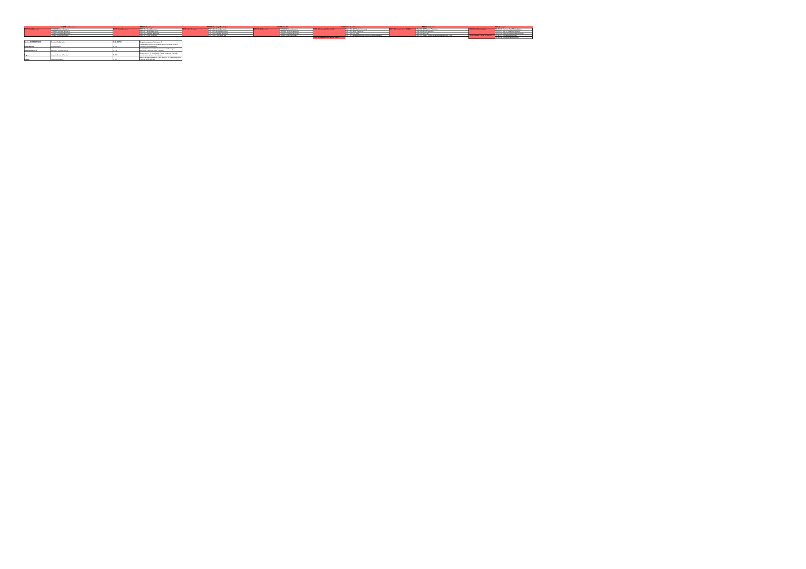

6. MAPA DE ATAQUE (MITRE ATT&CK)

6.1 Que es MITRE ATT&CK

MITRE ATT&CK es una base de conocimiento que organiza tecnicas utilizadas por atacantes en escenarios reales. En este proyecto se usa para relacionar algunas amenazas identificadas en el sistema con formas de ataque conocidas.

Para este trabajo no se busca cubrir toda la matriz ATT&CK, sino seleccionar las tecnicas que tienen relacion mas directa con las amenazas principales de la plataforma de votacion.

6.2 Tecnicas Identificadas

| ID Tecnica | Nombre de la tecnica | Tactica | Amenaza relacionada | Mitigacion general |
| ---------- | -------------------- | ------- | ------------------- | ------------------ |
| T1498 | Network Denial of Service | Impact | TH01 - Denegacion de servicio en el acceso al sistema | WAF, rate limiting y proteccion contra trafico malicioso. |
| T1078 | Valid Accounts | Initial Access | TH02 - Suplantacion de identidad del votante | MFA, control de sesiones y monitoreo de accesos. |
| T1528 | Steal Application Access Token | Credential Access | TH02 - Suplantacion de identidad del votante | Tokens de corta duracion y validacion de sesiones. |
| T1557 | Adversary-in-the-Middle | Collection / Credential Access | TH03 - Manipulacion del voto antes del registro | Cifrado en transito y proteccion de comunicaciones entre componentes. |
| T1565 | Data Manipulation | Impact | TH03, TH06, TH08 - Manipulacion del voto, resultados o logs | Validaciones de integridad, controles de acceso y auditoria. |
| T1070 | Indicator Removal on Host | Defense Evasion | TH08 - Alteracion de logs y evidencia | Proteccion de logs y registros centralizados de auditoria. |
| T1068 | Exploitation for Privilege Escalation | Privilege Escalation | TH07 - Elevacion de privilegios | Minimo privilegio, control de accesos y revision de permisos. |

6.3 Relacion con el Analisis del Proyecto

Las tecnicas seleccionadas permiten complementar el analisis STRIDE y DREAD, ya que muestran ejemplos concretos de como podria actuar un atacante sobre el sistema. Por ejemplo:

- T1498 se relaciona con la interrupcion del acceso a la votacion.
- T1078 y T1528 se relacionan con la suplantacion de identidad del votante.
- T1557 y T1565 se relacionan con la manipulacion del voto o de los resultados.
- T1070 se relaciona con el intento de ocultar evidencia en auditorias.
- T1068 se relaciona con accesos indebidos a funciones administrativas.

6.4 Visualizacion

6.5 Resumen

El uso de MITRE ATT&CK en este trabajo ayuda a conectar las amenazas del proyecto con tecnicas conocidas en ciberseguridad. Esto permite entender mejor como podrian producirse ciertos ataques y que controles generales conviene aplicar para reducir el riesgo.
